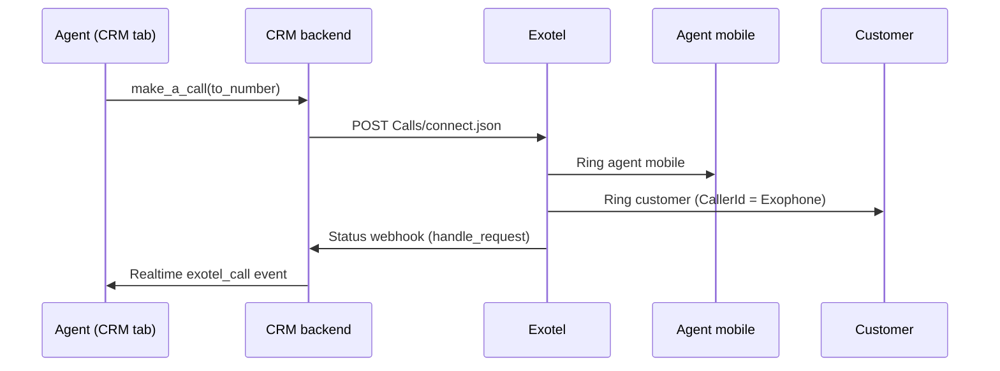

# Exotel CRM Softphone — Feasibility

As of 2026-09-29.

## Summary

An in-browser Exotel softphone is technically feasible and works end to end on the existing account in Chrome. The same account and API credentials work; the generic Veeno onboarding requirements in Exotel's public documentation do not apply to this account.

Proven: authentication, user mapping, browser registration, outbound and inbound browser calling with two-way audio, mute/hold/reject/hang-up, `CallSid` correlation, recording, and call-log persistence for answered, missed and rejected calls (via the `callback` app setting, flow Passthru, and a Calls API reconcile job). Safari connects without audio and falls back to mobile calling.

The CRM integration sits behind disabled-by-default global and per-agent switches. The app-level token no longer reaches the browser: the server makes every token-bearing request and the browser registers with only the agent's own mapping ([exotel-softphone-server-token-plan.md](exotel-softphone-server-token-plan.md)). Per-user tokens from Exotel are no longer a blocker.

- Implementation plan and progress: [exotel-softphone-persistence-plan.md](exotel-softphone-persistence-plan.md).
- Everything still outstanding, with context: [exotel-softphone-open-items.md](exotel-softphone-open-items.md).

## Current Exotel setup

Today the CRM uses Exotel click-to-call: Exotel rings the agent's own mobile, then bridges to the customer. No call audio passes through the browser.



The webhook updates the `CRM Call Log`, and the realtime event drives the call popup.

| Piece | Location | What it does |
| --- | --- | --- |
| Outgoing call | `crm/integrations/exotel/handler.py` → `make_a_call` | Calls `Calls/connect.json` from `mobile_no` with `exotel_number` as caller ID; creates the call log linked to the Lead/Deal |
| Webhook | `handler.py` → `handle_request?key=<webhook_verify_token>` | Guest endpoint; creates/updates `CRM Call Log`, then publishes `exotel_call` to the agent |
| Settings | `CRM Exotel Settings` | `enabled`, `account_sid`, `api_key`, `api_token`, `record_call`, `webhook_verify_token`, `subdomain` |
| Agent | `CRM Telephony Agent` | `mobile_no`, `exotel_number`, `twilio_number`, `default_medium`, `call_receiving_device` |
| Medium switch | `frontend/src/components/Telephony/CallUI.vue` | Routes each call to Twilio or Exotel |
| Call popup | `frontend/src/components/Telephony/ExotelCallUI.vue` | Socket-driven status, notes, disposition, task (~1,070 lines) |

The Twilio integration already runs a true browser softphone: `@twilio/voice-sdk` `Device`, a backend `generate_access_token`, and the agent's `call_receiving_device` choice. An Exotel softphone can follow the same pattern.

## What the Exotel softphone is

Exotel's WebRTC SDK puts a softphone inside the CRM tab, so agents make and take calls through the browser. With "IP-PSTN intermix", each agent can switch between browser calling (IP) and their mobile (PSTN) depending on their network ([Exotel onboarding article](https://support.exotel.com/support/solutions/articles/3000120566-ip-pstn-intermix-customer-onboarding-and-webrtc-sdk-integration)).

- **Package:** `@exotel-npm-dev/exotel-ip-calling-crm-websdk` (Apache-2.0, beta; Exotel documents a 1.4 MB WebSDK) — [GitHub repo](https://github.com/exotel/exotel-ip-calling-crm-websdk)
- **Auth:** the exact token flow for this enabled account must be confirmed during the spike. No new Exotel account or API key/token is required.
- **Resources:** Customer → Application → Users. Exotel specifies the agent's email address as the App User ID and generates the SIP credentials.
- **API host:** `integrationscore.mum1.exotel.com`, separate from the host in the CRM's `subdomain` setting.
- **Versioning:** GitHub's latest release is `v1.3.0`, while npm currently reports `1.2.2`. Pin and test an exact version rather than installing an unconstrained latest version.

```js
const sdk = new ExotelCRMWebSDK(accessToken, userId, autoConnectVOIP)
const phone = await sdk.Initialize(onCallEvent, onRegistration)
phone.MakeCall(number, dialCallback)
phone.AcceptCall()
phone.HangupCall()
phone.ToggleMute()
phone.ToggleHold()
```

## Confirmed account capabilities

These account-specific confirmations override the generic new-account onboarding path in Exotel's public softphone documentation.

| # | Confirmation | Impact |
| --- | --- | --- |
| 1 | Existing Exotel account supports softphone calling | No new Veeno account, agreement or KYC path is required |
| 2 | Existing API key/token remain valid | Reuse current `CRM Exotel Settings`; add fields only if the enabled softphone token flow requires values not already stored |
| 3 | SDK remains beta and public documentation describes the service as alpha | Retain a kill switch and validate behavior against the enabled account |
| 4 | Firewall: TCP 80/443, UDP 10000–40000, SIP `voip.in1.exotel.com`, media IPs 61.246.82.75, 14.194.10.247 (Bangalore), 182.76.143.61, 122.15.8.18 (Mumbai) | Office and VPN networks must allow these |
| 5 | Browsers: Chrome/Firefox/Edge (Windows), Chrome/Firefox (Linux), Chrome/Firefox/Safari 11+ (Mac); HTTPS; mic permission | Agent must be logged in with the SDK registered to receive browser calls |

## Development kickoff

Start by getting the softphone-specific details from Exotel, then prove the SDK works outside the CRM before changing CRM code.

### Step 0: Credentials and details

| Item | Status | Used for |
| --- | --- | --- |
| Account SID, API key, API token, subdomain | Have | Existing API calls; likely also auth for the token API |
| Exophone | Have | Caller ID and inbound calls; confirm it is linked to a softphone-capable call flow |
| Customer ID, Customer Secret, App ID and App Secret | Have | Customer/app token generation and user APIs |
| App User mapped from the developer's email | Have | SDK `userId`; mapped dashboard user supplies the SIP device |
| Client ID / client secret | Not required by tested flow | Public onboarding article differs from this account's working API flow |
| Create Authentication Token API: URL and parameters | Have | Customer and app token generation; tested app token validity is 90 days |
| WebRTC callback configuration: URL, payload sample, authentication | Ask Exotel | Call-log persistence |

Ask Exotel only for the unresolved callback configuration and remaining account-specific behavior listed below.

Keep credentials out of chat, this file and code. Store them in `CRM Exotel Settings` (Password fields) or the local `site_config.json`.

### Step 1: Standalone SDK spike

Allow 0.5–1 engineering day after Exotel supplies every required account detail. Exotel support turnaround is not included.

Keep this outside the CRM so SDK issues and CRM issues stay separate.

1. Clone [exotel/exotel-voip-websdk-crm-sample-app](https://github.com/exotel/exotel-voip-websdk-crm-sample-app).
2. Generate a token with `curl` using the existing credentials and the App User.
3. Serve the sample on `localhost`; browsers allow mic access there without HTTPS.
4. Register the browser, call your own mobile, then call the Exophone from the mobile to test inbound.
5. Log every SDK event and the `CallSid` on each.
6. Test registration loss, poor network, token expiry, browser refresh, logout and duplicate initialization.
7. Confirm whether token renewal can happen in place or requires unregistering and reinitializing the SDK.

Diagnose failures by layer before touching CRM code: token request and parameters, account/user provisioning, browser permissions, firewall/network, SDK/sample-app behavior, then Exotel service. Escalate to Exotel with captured request IDs and SDK events when local causes are excluded.

#### Step 1 results (2026-09-24)

Outbound browser calling works in Chrome with two-way audio on the existing account. The spike page lives outside the CRM repo at `~/projects/exotel-websdk-spike/spike/` (`index.html`, `main.js`, `provision.py`), using `@exotel-npm-dev/exotel-ip-calling-crm-websdk@1.2.2` with `@exotel-npm-dev/webrtc-client-sdk@2.0.5`.

Provisioning sequence that worked (all on `integrationscore.mum1.exotel.com/v2/integrations`, `Authorization` = raw token, no `Bearer` prefix):

1. `POST /token` with `Entity: customer` (Customer ID + Secret) → customer token.
2. `POST /app` with the customer token + existing Account SID, API key, API token → AppID + AppSecret. The app does not appear in the Exotel dashboard; list it with `GET /app?entity=customer`.
3. `POST /token` with `Entity: app` → app token (valid 90 days). This is the token the SDK uses.
4. `POST /app_setting` with at least one `Key`/`Value` (e.g. `record` = `true`). Without any setting, SDK initialization stops at `GET /app_setting` (404).
5. `POST /usermapping` with the app token, `AppUserId` = agent email, mapped to an existing dashboard user that has a SIP device. Mapping with the customer token instead attaches it outside the app and the SDK cannot find it.

| Finding | Impact on the CRM build |
| --- | --- |
| App User ID = agent email; mapping returns `SipId`, `SipDeviceID`, `ActiveDeviceId` | Provision per Telephony Agent from their CRM email; the dashboard user must have a SIP device |
| Outbound: `MakeCall` → Exotel first rings the browser as an `incoming` event; the customer is dialled only after `AcceptCall()`. Unaccepted → `Leg1Status: no-answer`, customer never rings | Auto-accept when the incoming `callSid` matches the `CallSid` from the dial response |
| One `CallSid` across the `MakeCall` response, SDK events (`callSid`, `X-Exotel-Callsid` header) and the classic Calls API (`GET /v1/Accounts/{sid}/Calls/{CallSid}.json`) | Create the call log from the dial response; update it by `CallSid`. Classic API returns `Direction: outbound-dial`, already handled by `get_call_log_status` |
| Agent-leg caller ID is unreliable (`cxuseri6957fa8e` on one call, `+9169573283` on the `LegsPlatform` route) | Show the dialled number from CRM state, never the SIP `From` |
| SDK event fields (`callDirection`, `callState`, times, `callEndReason`) are empty | Status, duration and recording come from server callbacks or the Calls API |
| Safari: call connects, no audio either way; Chrome: two-way audio | Support Chrome only initially; Safari needs autoplay/mic-permission handling |
| Registration fires `sent_request` twice before `registered`, then re-registers periodically | Initialize the softphone once per session; guard against duplicate instances |

Still to verify in Step 1: inbound to the Exophone, mute/hold, and re-registration after page refresh.

#### CRM integration status (2026-09-25)

The first local integration slice is implemented:

- Pinned `@exotel-npm-dev/exotel-ip-calling-crm-websdk@1.2.2` in the frontend.
- Added `softphone_enabled`, `softphone_app_id` and encrypted `softphone_app_secret` to `CRM Exotel Settings`.
- Added an independent `exotel_softphone_enabled` agent toggle; the existing Twilio `call_receiving_device` remains unchanged.
- Added an authenticated current-user config/token endpoint. App credentials remain server-side; disabled and non-opted-in agents receive no token.
- Added singleton SDK initialization, registration tracking and unregister on unmount/page exit.
- Routes Exotel calls through the browser only when registration is ready; otherwise preserves classic mobile click-to-call.
- Creates one Call Log from the SDK dial/incoming `CallSid` before accepting an outbound browser leg, then leaves status/recording persistence to server callbacks.
- Auto-accepts only an incoming SDK leg whose `CallSid` exactly matches the pending outbound dial response.
- Added browser controls for accept/reject, hangup, mute and hold.
- Added backend token/config/call-registration/callback tests and frontend `CallSid` extraction tests.

All new switches default off. Local schema migration and automated tests pass. Real CRM browser testing still requires entering the existing App ID/App Secret, enabling the global switch and opting in one mapped agent.

This slice did not resolve the app-wide token risk. That was fixed later by keeping the token on the server; see [exotel-softphone-server-token-plan.md](exotel-softphone-server-token-plan.md).

#### Local CRM pilot result (2026-09-28)

Outbound browser calling now works from the CRM in Chrome with two-way audio:

- The CRM user email must exactly match the Exotel `AppUserId`; the local pilot uses `cx@indiframe.com`.
- `ExotelCallUI` must initialize on mount. Depending only on the parent integration-setting watcher skipped setup when the enabled state loaded before the child ref was ready.
- The SDK dependency mixes ESM and CommonJS. Production builds require Vite `build.commonjsOptions.transformMixedEsModules = true`; lazy dynamic import left a runtime `require()` and failed in the browser.
- Browser registration reached `registered`, then the CRM outbound call used the WebSDK rather than classic mobile click-to-call.
- Browser and customer had two-way audio.
- CRM and Exotel contained the same `CallSid`; exactly one Call Log existed for it.
- Exotel reported `Direction: outbound-dial`, `Status: completed`, 33-second duration and a recording URL.
- CRM Call Log initially remained `Ringing`, confirming that browser SDK state alone does not complete persistence.

### Step 2: Real callback result (2026-09-28)

Adding the WebRTC app setting `callback` through `POST /app_setting` delivered authenticated POST requests to the existing CRM webhook through ngrok. This is an app-level setting, separate from the per-call `StatusCallback` used by classic `Calls/connect`.

One connected outbound call produced two active callbacks followed by one terminal callback. All three used the same `CallSid` returned by `MakeCall` and stored in the CRM Call Log.

The WebRTC payload differs from the legacy webhook contract:

| WebRTC field | Legacy/CRM field | Observed behavior |
| --- | --- | --- |
| `CallStatus` | `Status` | Empty while active; `completed` on terminal event |
| `CallState` | status fallback | `active` maps to `in-progress`; final event is `terminal` |
| `AppUserID` | `AgentEmail` | Mapped agent email |
| `FromNumber` | `CallFrom` | Calling leg |
| `VirtualNumber` | `To` | Exophone/telephony medium |
| `TotalDuration` | `ConversationDuration` | 10 seconds on captured terminal event |
| `CallRecordings` | `RecordingUrl` | Recording URL appears on terminal event |
| `Direction: outbound` | `outbound-dial` | Normalized before existing status mapping |
| ISO timestamps with offset | naive site-local Datetime | Convert before MariaDB persistence |

The handler now normalizes both callback formats, updates the existing Call Log by `CallSid`, persists terminal status/duration/recording/timestamps, ignores delayed active events after a terminal state, and avoids saves/realtime events for exact duplicates. Replaying the captured terminal and active callbacks preserved `Completed`, duration, recording, and the Call Log's `modified` timestamp.

The temporary authenticated ngrok callback remains configured for continued local testing. Replace it with the stable production CRM URL or confirm Exotel's app-setting deletion procedure before stopping the tunnel. Inbound callbacks, missed calls, mute/hold, refresh recovery and SIP-to-PSTN switching remain unverified.

#### Inbound SIP routing result (2026-09-28)

Installed SDK source confirms that the browser `incoming` event is raised when the SIP client receives an `INVITE` over its SIP WebSocket. The CRM WebSDK makes one-off Integration Core requests for app settings, user mapping and outbound calls; it has no separate Integration Core event stream. Exotel's `Create popup` URL is therefore optional inbound metadata notification, not the mechanism that rings the browser. Whether Integration Core forwards those notifications to the app's `popup`, `missedCall` and `incomingCallHangup` setting URLs is still unverified.

The shared Exophone flow repeatedly selected another mobile agent even while the mapped `cx@indiframe.com` SIP device was active and available. Executing a copied flow directly through Exotel's connect-to-flow API, with its Connect applet targeting only the one-agent softphone group, produced:

- an SDK `incoming` event in the CRM browser;
- a new Incoming CRM Call Log using the SIP INVITE's `CallSid`;
- the same `CallSid` in Exotel with `Status: completed`.
- working hold/resume control, with the customer leg audibly placed on hold.

Exotel classified this test as `outbound-api`, not a true Exophone inbound call, and the app-level WebRTC callback did not update its CRM Call Log from `Ringing`. It proved that the copied flow could route a SIP INVITE to the registered CRM browser, but did not prove PSTN inbound callback persistence, recording, missed-call behavior, or mute.

A subsequent true inbound test temporarily linked the existing Exophone to the copied one-agent flow and called it through the PSTN. API verification showed:

- the browser received the SIP call and created one Incoming CRM Call Log using the same `CallSid`;
- Exotel classified it as `inbound` and `completed`;
- both call legs completed, with a 20-second conversation inside a 34-second call;
- Exotel produced a recording URL.

No matching request reached the CRM webhook, so the CRM Call Log remained `Ringing` with no duration or recording. This proves true inbound browser routing and Exotel-side recording, while isolating inbound metadata delivery as the remaining persistence gap. The documented `Create popup` Integration Core path is not required to ring the browser, but now needs a separate test to determine how initiated, hangup and missed-call notifications reach the app's `popup`, `incomingCallHangup` and `missedCall` setting URLs.

### Step 3: CRM build

1. Branch off `custom/develop` (for example `feat/exotel-softphone`).
2. Build in the order of the production plan below: settings and kill switch → token endpoint → SDK in `ExotelCallUI.vue` behind the per-agent toggle → callback mapping → tests.
3. Enable it for one agent first.

### Step 4: Acceptance tests

The one-agent rollout passes only when all criteria hold:

| Scenario | Pass criteria |
| --- | --- |
| Outgoing browser call | One `CRM Call Log` per `CallSid`; correct agent, customer number, Lead/Deal link and Exotel medium |
| Incoming browser call | Correct agent receives one popup; accepting and rejecting update the same Call Log |
| Status lifecycle | Ringing, answered and terminal callbacks update one record in order; delayed or repeated callbacks do not regress status |
| Duplicate callbacks | Replaying each captured callback creates no duplicate Call Log and no duplicate realtime side effect |
| Recording | Enabled calls persist a usable recording URL; disabled calls do not |
| Browser controls | Accept, hang up, mute, unmute, hold and resume match SDK state |
| Registration lifecycle | Refresh does not double-register; logout, unmount and device switch call `UnRegisterDevice()` |
| Recovery | Registration loss and network recovery reconnect once without duplicate listeners or calls |
| Token expiry | Renewal follows the confirmed SDK flow without losing an active call or registering twice |
| PSTN fallback | Confirmed fallback behavior works when SIP is disabled, registration fails or the CRM tab is unavailable |
| Authorization | Agent can fetch only their own token/user configuration; disabled agents cannot initialize the SDK |
| Browser/network matrix | Supported browsers and office/VPN networks pass microphone, inbound, outbound and audio tests |

## Provisional production plan

Call-data persistence items below (callbacks, call logs, tests) are superseded by [exotel-softphone-persistence-plan.md](exotel-softphone-persistence-plan.md). The rest is kept for reference:

1. **Settings**
    - Reuse the existing account and `CRM Exotel Settings`.
    - Add only fields proven necessary by the enabled account's token and application configuration.
    - Add a global softphone kill switch independent of the existing Exotel integration toggle.
2. **Agent**
    - Use the agent email as Exotel App User ID unless the spike proves a distinct stored identifier is required.
    - Add an Exotel-specific browser-calling toggle. Do not reuse `call_receiving_device`: that field already controls Twilio routing and defaults to `Computer`.
3. **Backend**
    - Add an authenticated token endpoint scoped to the current CRM user.
    - Add idempotent user provisioning and device-state management.
    - Adapt or add a verified webhook endpoint for the confirmed WebRTC callback contract.
4. **Frontend**
    - Pin the tested SDK version with Yarn.
    - Create one softphone instance per session; guard against repeated initialization.
    - Route outgoing calls through `MakeCall` when Exotel browser calling is enabled.
    - Handle registration, incoming, connected, ended, mute and hold events in the existing call UI.
    - Call `UnRegisterDevice()` on logout, unmount and device switch. Implement reconnect and confirmed token-renewal behavior.
5. **Call logs**
    - Keep server callbacks, not browser state, as the persistence source of truth.
    - Upsert by the validated `CallSid` and map the App User ID to the CRM user server-side.
    - Preserve Lead/Deal linking, disposition, recording and realtime popup behavior.
6. **Tests and rollout**
    - Add backend tests for token authorization, provisioning, callback authentication, payload mapping and idempotent call-log updates.
    - Automate applicable Step 4 criteria; manually run browser, microphone, office/VPN, audio and PSTN fallback checks.
    - Roll out to one agent first; retain the kill switch and PSTN fallback.

## Open questions for Exotel

- What is the per-user price on the Unlimited Calling Plan, and when does the feature leave alpha?
- Do the currently assigned Exophone numbers and call flows require any softphone-specific configuration?
- Is the proven outbound callback contract and `CallSid` behavior identical for inbound and missed calls?
- What is the authentication-token lifetime, and does renewal require SDK reinitialization?
- If the agent is logged out, the tab is closed or registration fails, is PSTN fallback automatic or must the agent toggle it before failure?

**Next step:** validate an inbound browser call, mute/hold, refresh recovery and PSTN fallback with the one mapped Chrome agent. Keep wider rollout disabled until those paths and callback-setting rollback are proven.

## Sources

- [IP-PSTN Intermix customer onboarding and WebRTC SDK integration](https://support.exotel.com/support/solutions/articles/3000120566-ip-pstn-intermix-customer-onboarding-and-webrtc-sdk-integration) — Exotel support
- [exotel/exotel-ip-calling-crm-websdk](https://github.com/exotel/exotel-ip-calling-crm-websdk) — GitHub
- [Exotel WebRTC CRM sample app](https://github.com/exotel/exotel-voip-websdk-crm-sample-app) — GitHub
- [IP-PSTN Intermix WebRTC SDK API](https://developer.exotel.com/api/ip-pstn-intermix-webrtc-sdk-integration) — linked by Exotel support; direct retrieval returned 404 during this review, so confirm the current canonical API URL with Exotel
